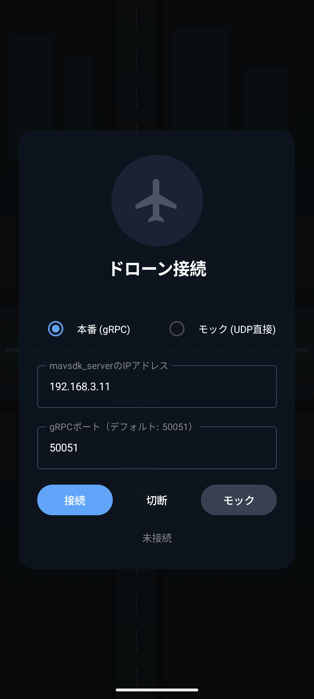
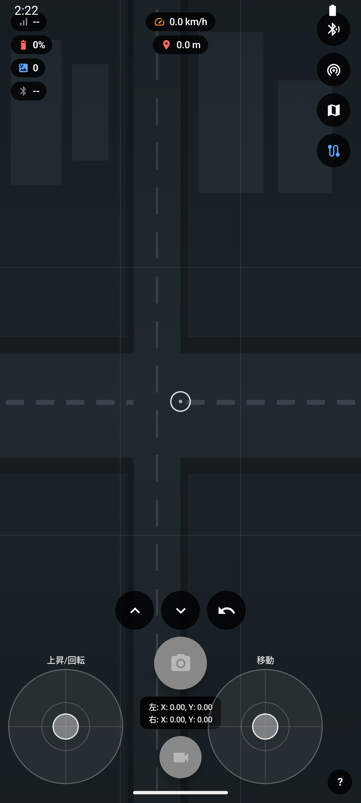
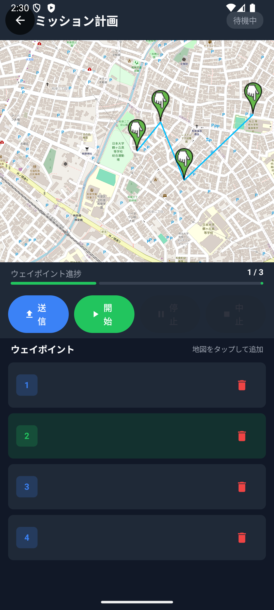
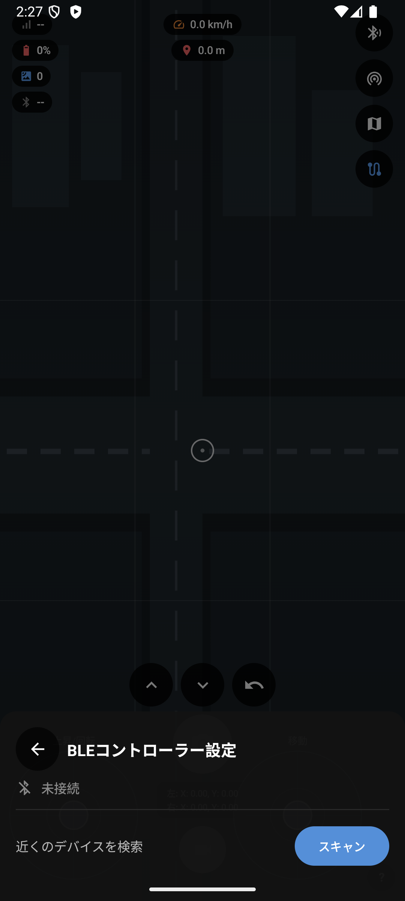

# drone-controller

MAVLink対応Androidドローンコントローラーアプリ（KMP）


## スクリーンショット

| 接続画面 | コントローラー画面 |
|---|---|
|  |  |

| ミッション計画 | BLE設定 |
|---|---|
|  |  |

## 概要

NTT e-Drone Technology 応募用ポートフォリオ。  
PX4 SITLシミュレーターとの実際の通信確認済み。  
KMP（Kotlin Multiplatform）+ Compose Multiplatform で構築。

## 技術スタック

| カテゴリ | 技術 |
|---|---|
| UI | Kotlin / Compose Multiplatform / Material3 |
| 通信 | MAVLink / io.mavsdk / gRPC / UDP |
| DI・非同期 | Koin / Coroutines + StateFlow |
| アーキテクチャ | Clean Architecture + MVVM |
| 地図 | OpenStreetMap（osmdroid） |
| 周辺機器 | BLE（GATT） |

## 機能一覧

- MAVLink接続・HEARTBEAT受信
- リアルタイムテレメトリ表示（高度・バッテリー・速度・衛星数・姿勢）
- 基本コマンド（離陸・着陸・RTL）
- 仮想ジョイスティック（MAVLink送信）
- BLE物理コントローラー連携
- ミッション計画（ウェイポイント設定・自律飛行）
- 地図表示（OpenStreetMap）
- Foreground Service（画面OFF時も接続維持）
- モックモード（SITL不要でUI確認可能）

## アーキテクチャ

```
commonMain
├── ui/         # Compose Multiplatform
├── domain/     # UseCase・Repository Interface
└── data/       # MAVLink・BLE実装
androidMain     # Android固有処理
iosMain         # iOS（将来対応）
```

## 接続構成

```
drone-controller（Android）
  → gRPC:50051 → mavsdk_server（PC）
  → UDP:14540  → PX4 SITL / 実機
```

## ビルド方法

```bash
./gradlew :composeApp:assembleDebug
```
